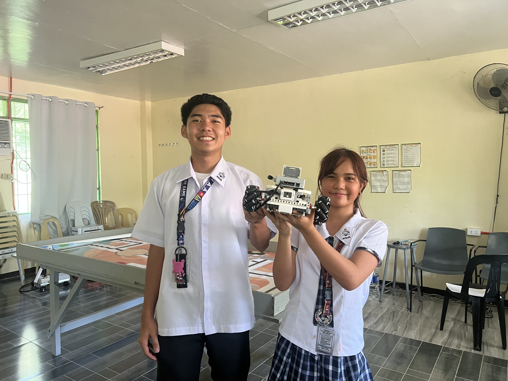
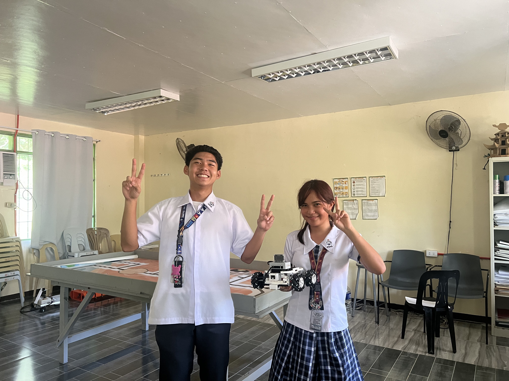
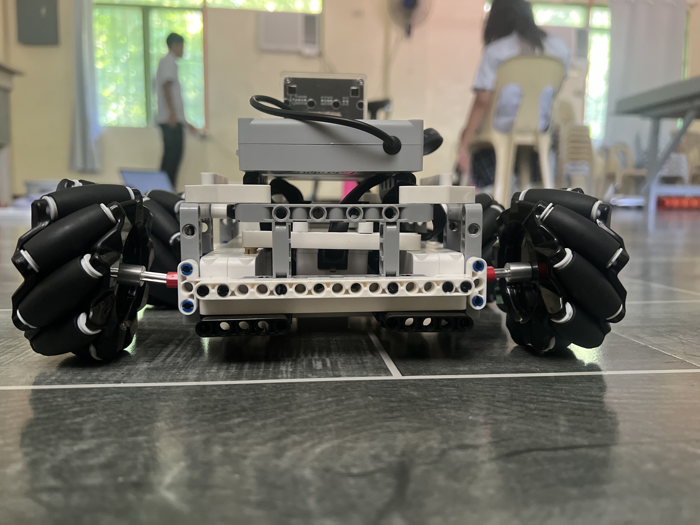
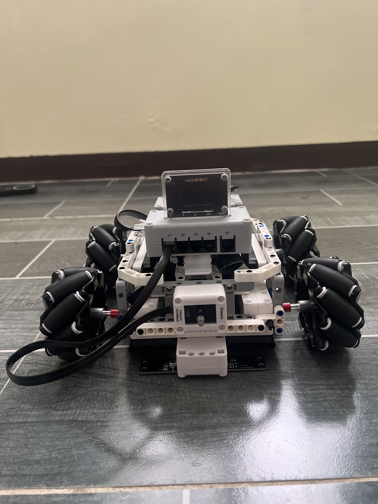
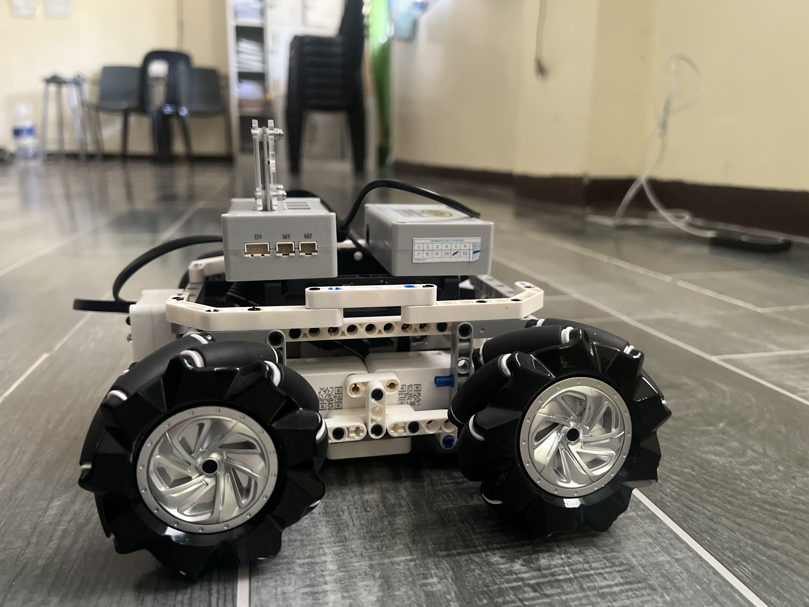
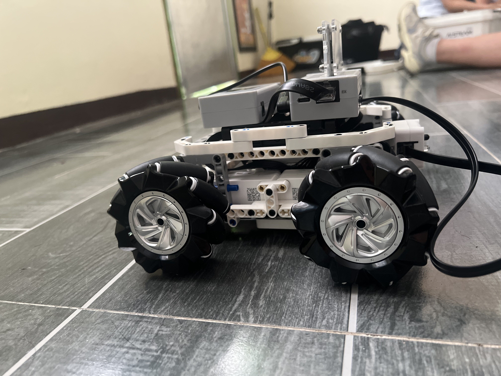
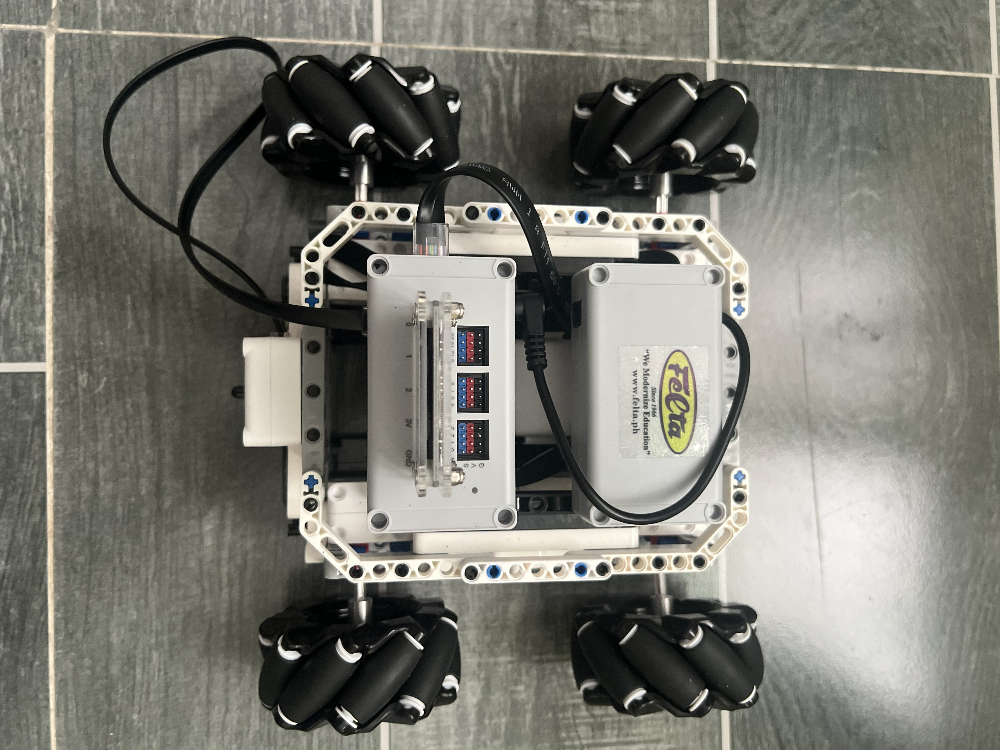
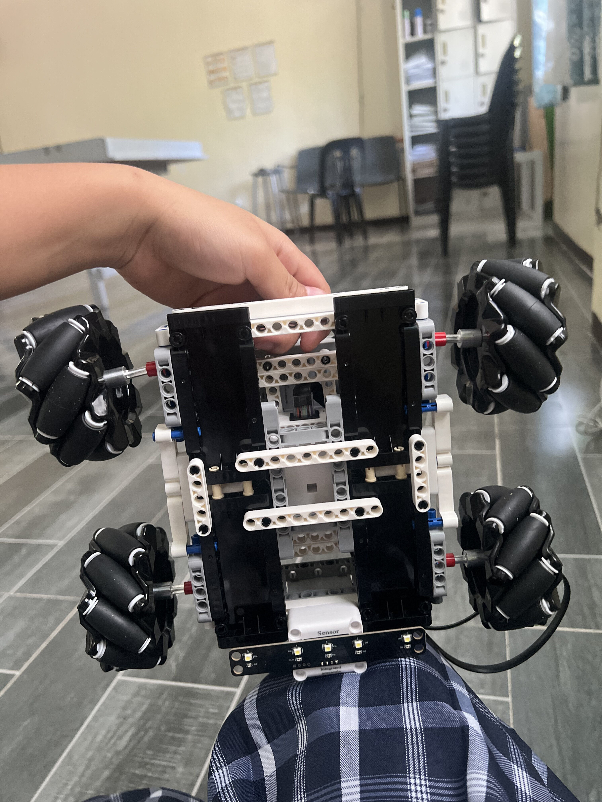

# PRO26--RSHS_III-TEAM_2
# AISTEAM — WRO Future Engineers Self-Driving Vehicle
### WRO 2025 Future Engineers — Self-Driving Cars Challenge

## Introduction

This repository contains engineering materials of a self-driven vehicle's model
participating in the WRO Future Engineers competition in the season 2025.

The vehicle is built entirely on the **AISTEAM controller and module kit**, an
educational robotics platform that supports block-based programming through a
Scratch-style interface. Our goal was to design a car capable of completing the
Open Challenge — three autonomous laps with randomized inner track wall placement —
without any driver intervention, using only onboard sensing and onboard computation.

The purpose of this document is to explain, in line with WRO's documentation
requirements, which software modules make up our control program, how each module
maps onto a physical electromechanical component of the vehicle, and the exact
process required to build, compile, and upload our code to the vehicle's
controllers. This README is written so that a judge, mentor, or another team with
no prior exposure to our code base can understand the system end-to-end.

## Table of Contents

1. [Vehicle Overview](#vehicle-overview)
2. [Electromechanical Architecture](#electromechanical-architecture)
3. [Wiring and Connections](#wiring-and-connections)
4. [Software Architecture](#software-architecture)
5. [Module-to-Hardware Mapping](#module-to-hardware-mapping)
6. [Sensing and Perception Strategy](#sensing-and-perception-strategy)
7. [Control and Motion Strategy](#control-and-motion-strategy)
8. [Build, Compile, and Upload Process](#build-compile-and-upload-process)
9. [Running the Vehicle at Competition](#running-the-vehicle-at-competition)
10. [Repository Structure](#repository-structure)
11. [Known Limitations and Future Work](#known-limitations-and-future-work)

---

## Vehicle Overview

* `t-photos` contains 2 photos of the team (an official one and one funny photo with all team members)
* `v-photos` contains 6 photos of the vehicle (from every side, from top and bottom)
* `video` contains the video.md file with the link to a video where driving demonstration exists
* `schemes` contains one or several schematic diagrams in form of JPEG, PNG or PDF of the electromechanical components illustrating all the elements (electronic components and motors) used in the vehicle and how they connect to each other.
* `src` contains code of control software for all components which were programmed to participate in the competition
* `models` is for the files for models used by 3D printers, laser cutting machines and CNC machines to produce the vehicle elements. If there is nothing to add to this location, the directory can be removed.
* `other` is for other files which can be used to understand how to prepare the vehicle for the competition. It may include documentation how to connect to a SBC/SBM and upload files there, datasets, hardware specifications, communication protocols descriptions etc. If there is nothing to add to this location, the directory can be removed.

### Team Photos

| Official Photo | Funny Photo |
|:---:|:---:|
|  |  |

### Vehicle Photos

| Front | Back |
|:---:|:---:|
|  |  |

| Left | Right |
|:---:|:---:|
|  |  |

| Top | Bottom |
|:---:|:---:|
|  |  |

### Driving Demonstration Video

▶️ **[Click here to watch the driving demonstration](https://drive.google.com/file/d/1SYZ8zzjICA0w-TKJidTM_OpNrfjVLLTG/view?usp=sharing)**

---

## Electromechanical Architecture

The vehicle carries a central electronics stack consisting of the main AISTEAM
controller board, a dedicated motor expansion module, and a wiring harness that
connects both to the drive motors. A grayscale sensing module is mounted at the
front-bottom of the chassis to detect the track line, and an infrared barrier
avoidance module is mounted at the front to detect walls and obstacles. The
following table summarises every module used in this build:

| Module | Part Role |
|---|---|
| **AISTEAM Controller** | Central processing unit; runs the block program and interfaces with all other modules via expansion connectors |
| **Motor Expansion Module** | 2-channel H-bridge motor driver; receives speed and direction commands from the controller and converts them to PWM signals that drive the encoder motors |
| **Encoder Motor Module (×2)** | Left and right rear drive wheels; brushed DC gear motors with integrated rotary encoders that feed wheel-rotation pulse counts back to the controller |
| **Integrated Grayscale Sensing Module** | Three-channel (Left, Middle, Right) reflectivity sensor; distinguishes the black track line from the white track surface |
| **Infrared Barrier Avoidance Module** | Front-facing IR proximity sensor; returns a binary Obstacle Detected / No Obstacle signal |
| **Expansion Screen Module** | Small display used during development to show sensor values and vehicle state |
| **Lithium Battery Module** | Onboard rechargeable power supply; powers the controller and all expansion modules during autonomous runs |

> The vehicle does **not** use a camera or a color sensor. Obstacle and lane
> detection rely entirely on the infrared barrier avoidance module and the grayscale
> sensing module. The consequences of this design choice are documented in the
> Known Limitations section below.

---

## Wiring and Connections

Electrically, the vehicle is wired as follows:

| Connection | Cable Type | Purpose |
|---|---|---|
| Motor Expansion Module → Encoder Motor Left | Motor-integrated XH lead | Delivers PWM drive signal and power to the left rear motor |
| Motor Expansion Module → Encoder Motor Right | Motor-integrated XH lead | Delivers PWM drive signal and power to the right rear motor |
| AISTEAM Controller → Motor Expansion Module | Expansion module connection cable | Lets the controller issue speed and direction commands to both motors through one link |
| AISTEAM Controller → Integrated Grayscale Sensing Module | RJ11/XH connection cable | Carries left, middle, and right reflectance data to the controller |
| AISTEAM Controller → Infrared Barrier Avoidance Module | RJ11/XH connection cable | Carries the binary obstacle presence signal to the controller |
| AISTEAM Controller → Expansion Screen Module | I2C / display expansion cable | Sends debug and state information to the onboard display |
| Lithium Battery Module → AISTEAM Controller | Main power connector | Supplies regulated power to the controller and, through it, to all expansion modules |

The motor ports on the expansion module are assigned as follows:

- **Port A** — Left encoder motor (rear left drive wheel)
- **Port B** — Right encoder motor (rear right drive wheel)

This port mapping is the single most important reference for anyone reading the
motor control code, because the block program addresses motors by these port labels.
Every motor-control block in the program includes a comment cross-referencing this
table so the relationship between a code block and a physical motor is never
ambiguous.

---

## Software Architecture

The control program is organized as a **block program** in the AISTEAM
Scratch-compatible environment. Rather than a single flat script, the logic is
structured into clearly separated decision stages — each responsible for a single
concern — so that each stage can be tested, tuned, and debugged independently
before being integrated into the full autonomous driving loop.

1. **Entry point** — `When [Program Starts]` initializes the `forever` loop
   immediately. All AISTEAM modules power up and self-initialize when the controller
   boots, so no explicit setup phase is needed before the loop begins.

2. **Obstacle detection stage** — On every iteration, the outermost `if` block
   queries the Infrared Barrier Avoidance Module first. Obstacle avoidance is
   always evaluated before line-following because a collision with a wall or pillar
   must be prevented regardless of what the grayscale sensor reads.

3. **Line-following stage** — If no obstacle is detected, the grayscale module's
   three channels are read and compared against calibrated black/white thresholds.
   The resulting lateral error (which channel sees the line) drives a differential
   speed correction applied to the two encoder motors.

4. **Fallback stop** — If no grayscale channel detects the line at all, both motors
   are halted to prevent the vehicle from running off the track while it is out of
   lane.

5. **`config` (inline constants)** — All tunable values — motor speeds, wait
   durations, grayscale thresholds — are kept in named constants within `config.h`
   (or the equivalent block program constant blocks) so they can be adjusted for
   different track surfaces and lighting conditions without touching the control
   logic itself.

---

## Module-to-Hardware Mapping

The table below makes explicit how each software stage corresponds to a physical
component on the vehicle, which is the core requirement of this documentation:

| Software Stage / Block | Physical Component | Connection |
|---|---|---|
| Obstacle detection (`Infrared Sensor = Obstacle Detected`) | Infrared Barrier Avoidance Module | RJ11/XH cable to AISTEAM Controller |
| Motor speed commands (`Encoder Motor – Left / Right`) | Motor Expansion Module → Encoder Motor Modules | Expansion cable + motor XH leads |
| Grayscale reads (`Grayscale Left / Middle / Right`) | Integrated Grayscale Sensing Module | RJ11/XH cable to AISTEAM Controller |
| Program execution and `forever` loop | AISTEAM Controller (main board) | Central unit |
| Regulated power supply | Lithium Battery Module | Main power connector |
| Debug and state display | Expansion Screen Module | I2C / display cable |

---

## Sensing and Perception Strategy

The vehicle perceives its environment through two independent sensing channels,
each feeding a separate decision stage in the control program:

- **Lane perception** — The Integrated Grayscale Sensing Module reports three
  independent reflectivity readings (Left, Middle, Right), each compared against
  calibrated Black/White thresholds. The pattern across the three channels encodes
  the vehicle's lateral position relative to the track's center line: a centered
  reading (`Left=White, Middle=Black, Right=White`) indicates correct alignment,
  while a Black reading on either outer channel indicates drift toward that side.

- **Obstacle perception** — The Infrared Barrier Avoidance Module returns a single
  binary signal: Obstacle Detected or No Obstacle. It does not return distance,
  angle, or color information — only presence.

- **Sensor priority** — Because the IR module can only signal presence and not
  position, the program always checks it before evaluating the grayscale channels
  on every loop iteration. This guarantees the vehicle reacts to a wall or pillar
  even if it is currently mid-correction on the line.

- **No camera or color sensor** — Perception is intentionally limited to these two
  modules. The vehicle cannot distinguish pillar color, read signage, or detect
  obstacles outside the IR module's forward-facing cone. The implications of this
  are discussed further in Known Limitations and Future Work.

---

## Control and Motion Strategy

The following is the full autonomous control program as it appears in the AISTEAM
block programming environment, transcribed into structured pseudocode for
readability and for version-control purposes:

```
When [Program Starts]
forever
    if <Infrared Sensor = Obstacle Detected> then
        set [Encoder Motor – Left]  speed to (-30)
        set [Encoder Motor – Right] speed to (-30)
        wait (0.4) seconds
        set [Encoder Motor – Left]  speed to (30)
        set [Encoder Motor – Right] speed to (-30)
        wait (0.4) seconds
    else
        if <Grayscale Left = White> and <Grayscale Middle = Black> and <Grayscale Right = White> then
            set [Encoder Motor – Left]  speed to (50)
            set [Encoder Motor – Right] speed to (50)
        else
            if <Grayscale Left = Black> then
                set [Encoder Motor – Left]  speed to (15)
                set [Encoder Motor – Right] speed to (50)
            else
                if <Grayscale Right = Black> then
                    set [Encoder Motor – Left]  speed to (50)
                    set [Encoder Motor – Right] speed to (15)
                else
                    set [Encoder Motor – Left]  speed to (0)
                    set [Encoder Motor – Right] speed to (0)
```

**Stage-by-stage explanation:**

- **Obstacle detected** — Both motors reverse at speed −30 for 0.4 s to back
  away from the obstacle, then the left motor drives forward at +30 while the
  right motor continues reversing at −30 for 0.4 s, pivoting the vehicle away.

- **Centered on line** (`Left=White, Middle=Black, Right=White`) — Both motors
  run at 50, producing straight-ahead driving with no correction needed.

- **Drifted left** (`Left=Black`) — Left motor slows to 15, right motor holds
  at 50, arcing the vehicle back to the right and re-centering on the line.

- **Drifted right** (`Right=Black`) — Right motor slows to 15, left motor holds
  at 50, arcing the vehicle back to the left and re-centering on the line.

- **Line lost** (no channel reads Black) — Both motors stop at 0 to prevent the
  vehicle from leaving the track while the line is not detected.

---

## Build, Compile, and Upload Process

The following steps describe, end-to-end, how to take this repository and produce
a running program on the physical vehicle.

1. **Install the AISTEAM software.**
   Download and install the official AISTEAM programming application from the
   AISTEAM website. The application includes the block editor, compiler backend,
   and the USB upload driver required to communicate with the controller board.

2. **Connect the controller via USB.**
   Connect the AISTEAM Controller to your computer using the included USB
   programming cable. The AISTEAM application will detect the controller
   automatically. If the controller is not detected, install the CH340/CH341 USB
   serial driver included with the AISTEAM software package.

3. **Open the program file.**
   Open the AISTEAM application and load the block program file from the `src/`
   folder of this repository. The `forever` loop and all nested condition blocks
   will appear in the block editor exactly as documented in this README.

4. **Review configuration.**
   Before uploading, verify that the motor speed constants (currently 50 for
   cruise, 15 for correction, −30 for reverse) and the grayscale Black/White
   thresholds match your track surface and lighting conditions. These values are
   intentionally kept as named constants so they can be re-tuned without touching
   the control logic. Print raw grayscale values over the Expansion Screen Module
   display to calibrate thresholds if needed.

5. **Verify hardware module connections.**

   | Module | Expected port on controller |
   |---|---|
   | Motor Expansion Module | Motor expansion connector |
   | Encoder Motor – Left | Motor port A |
   | Encoder Motor – Right | Motor port B |
   | Integrated Grayscale Sensing Module | Analog sensor port (front-bottom) |
   | Infrared Barrier Avoidance Module | Digital sensor port (front) |
   | Expansion Screen Module | I2C / display expansion port |
   | Lithium Battery Module | Main power connector |

   Confirm that the module labels in the block program (e.g., `Encoder Motor – Left`)
   match the physical port assignments shown in the AISTEAM application's device
   configuration panel.

6. **Upload to the controller.**
   Click the **Upload** button in the AISTEAM application. The application compiles
   the block program into machine code and flashes it to the AISTEAM Controller
   over the USB connection. An `Upload Successful` message confirms completion.

7. **Disconnect USB and run on battery.**
   After a successful upload, disconnect the USB cable. The program is stored in
   the controller's flash memory and will run automatically on every power-on.
   During competition the vehicle must be fully autonomous and battery-powered with
   no USB connection present.

---

## Running the Vehicle at Competition

1. **Verify motor and sensor operation.**
   With the vehicle powered on from the battery but placed on a test surface,
   confirm that each motor responds correctly, that the grayscale module reports
   distinct Black and White readings on the track surface, and that the infrared
   barrier module fires when an object is placed in front of it. This step confirms
   that no wiring change has inadvertently shifted a connection since the last
   upload.

2. **Run on the track.**
   Place the vehicle on the track with the grayscale sensor aligned over the center
   black line and power on. The `forever` loop starts immediately. Observe straight
   driving when centered, left/right corrections when drifting, obstacle avoidance
   when the IR module fires, and a full stop when the line is lost.

---

## Repository Structure

```
.
├── README.md              # This document
├── src/                   # AISTEAM block program source file
├── schemes/               # Wiring and electromechanical diagrams
├── v-photos/              # Vehicle photos (all sides, top, bottom)
│   ├── vehicle_front.jpg
│   ├── vehicle_back.jpg
│   ├── vehicle_left.jpg
│   ├── vehicle_right.jpg
│   ├── vehicle_top.jpg
│   └── vehicle_bottom.jpg
├── t-photos/              # Team photos
│   ├── team_official.jpg
│   └── team_funny.jpg
├── video/                 # Link to driving demonstration video
│   └── video.md
├── models/                # 3D-printed / laser-cut part files (if applicable)
└── other/                 # Controller connection instructions, hardware specs
```

---

## Known Limitations and Future Work

Because this build uses an Infrared Barrier Avoidance Module rather than a camera
or color sensor, the vehicle cannot distinguish red pillars (keep-right) from green
pillars (keep-left) by color. The same fixed reverse-and-pivot avoidance response
is applied regardless of pillar color. This satisfies the geometric intent of the
obstacle avoidance rule — steer away from the side the pillar occupies — but does
not implement the full color-specific lane-selection semantics of the Obstacle
Challenge rules.

Additionally, the vehicle does not include a parallel parking routine in its
current firmware. The program is optimized for the Open Challenge. Extending it to
the full Obstacle Challenge would require adding a color sensor module for pillar
classification and a parking state machine to the block program.

We are evaluating an upgrade path that would add a color sensor module to close
these gaps. Until then, these limitations are documented here in the interest of
transparency for judges reviewing the engineering materials.

---

*This repository is maintained by our WRO Future Engineers team for the WRO 2025
Future Engineers Self-Driving Cars competition. Vehicle hardware is built on the
AISTEAM controller and module kit.*
